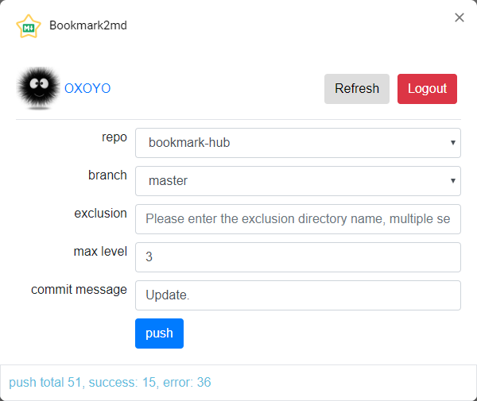

# bookmark2md

    A script for converting Chrome bookmarks to Markdown files


## Use script
```bash
  // step 1
  cd Script
  // step 2
  export chrome bookmarks to `/Script/bookmarks.html`
  // step 3
  node bookmark2md.js
```


## Use Chrome Extension

### Preview
 

 
