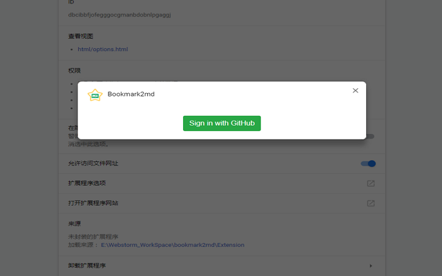
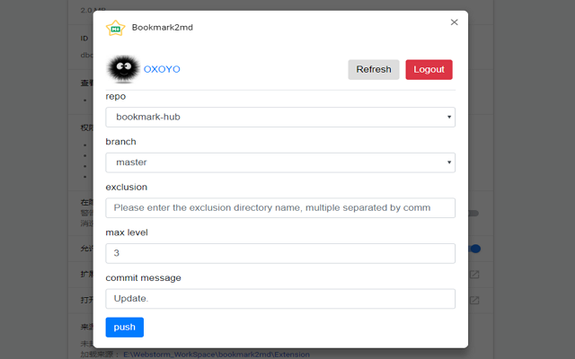

# bookmark2md

    将chrome书签转换为md文件并将它们推送到GitHub存储库。

[English](./README.md) | 简体中文

## 使用脚本
```bash
  // step 1
  cd Script
  // step 2
  export chrome bookmarks to `/Script/bookmarks.html`
  // step 3
  node bookmark2md.js
```


## Chrome 扩展程序

### 安装

Chrome应用商店安装地址：[Bookmark2md](https://chrome.google.com/webstore/detail/bookmark2md/gbclgdopkgkofbmioamakhnlogeajmll)

### 使用

Step 1:安装后在浏览器上点击Bookmark2md扩展进行登录，或通过扩展选项进行登录。



Step 2:
    1.选择要push到的仓库;
    2.选择分支;
    3.输入要排除的书签目录，多个请用英文逗号分隔;
    4.输入最大层级，用于控制相对于书签根节点最深几层的目录会生成独立的md文件；
    5.输入提交message。

Step 3:点击Push按钮提交。

***注意：可能会存在提交失败的情况，建议重复提交。***


